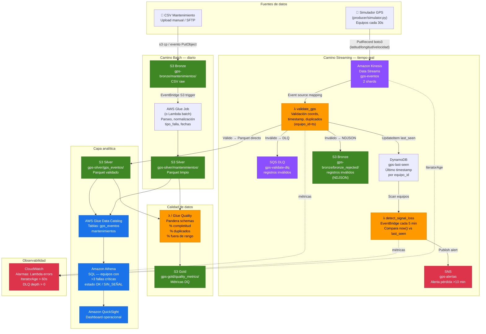

# Arquitectura GPS Pipeline

## Diagrama

---

## Flujo streaming (tiempo real)

El simulador GPS (`src/producer/simulator.py`) publica eventos JSON cada ~30 segundos por equipo hacia **Kinesis Data Streams** (`gps-eventos`, 2 shards), usando `equipo_id` como partition key para garantizar orden por dispositivo. Kinesis activa la Lambda `validate_gps` mediante un *event source mapping* con batch size configurable (recomendado: 100 registros, ventana 10 s): esta función valida coordenadas (latitud −90/90, longitud −180/180), rechaza timestamps futuros o con antigüedad >1 hora, y detecta duplicados consultando DynamoDB por la clave `equipo_id + timestamp`. Los registros válidos se escriben en S3 Bronze vía Kinesis Firehose (Parquet, compresión Snappy, particiones `yyyy/mm/dd/hh`) y se actualiza el campo `last_seen` en DynamoDB. Los registros inválidos se envían a la SQS DLQ para auditoría sin perder el mensaje. Una segunda Lambda, `detect_signal_loss`, se ejecuta cada 5 minutos a través de **EventBridge Scheduler**; escanea la tabla DynamoDB, calcula `now() − last_seen` por equipo, y publica una alerta en **SNS** (`gps-alertas`) por cada equipo que supere los 10 minutos sin señal. CloudWatch monitorea errores de Lambda, profundidad de DLQ e `IteratorAge` del stream (métrica crítica: si sube indica que el consumidor no está al día).

## Flujo batch (diario)

Los archivos CSV de mantenimiento se depositan en `s3://gps-bronze/mantenimientos/` (carga manual, SFTP, o proceso externo). Un evento **S3 PutObject** dispara automáticamente el job de **AWS Glue** (o una Lambda para volúmenes pequeños, ver nota de diseño abajo), que lee el CSV raw, normaliza los campos (`tipo_falla` → enum `CRITICA/MENOR`, fechas ISO-8601, `equipo_id` en mayúsculas), y escribe Parquet particionado por `fecha_mantenimiento` en `s3://gps-silver/mantenimientos/`. El **Glue Data Catalog** mantiene las definiciones de tabla para ambas capas silver (`gps_eventos` y `mantenimientos`), lo que permite a **Athena** consultarlas con SQL estándar sin mover datos. La capa gold recibe las métricas de calidad calculadas por el módulo Pandera: porcentaje de completitud, duplicados y valores fuera de rango, escritas en JSON/Parquet para trazabilidad. **QuickSight** se conecta directamente a Athena para el dashboard operacional.

---

> **Nota de diseño — Glue vs Lambda para batch:**
> Se elige Glue porque escala horizontalmente con DPUs y tiene integración nativa con el Catalog. La alternativa Lambda+Pandas es más barata para archivos <128 MB y latencia <15 min, pero tiene límite de memoria (10 GB) y no tiene checkpointing automático. Para este caso con CSVs diarios de tamaño moderado, ambas son válidas; Glue se defiende mejor ante crecimiento de volumen.
