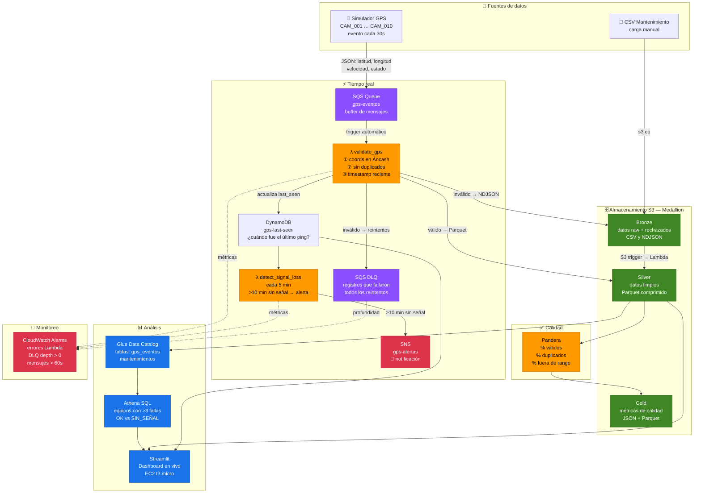

# GPS Pipeline — Arquitectura

## Diagrama



---

## Cómo fluyen los datos

### 1. Tiempo real — GPS

Cada 30 segundos, el simulador genera un evento por vehículo (`equipo_id`, coordenadas, velocidad, estado) y lo envía a una cola **SQS**. La Lambda `validate_gps` lee esa cola automáticamente y hace tres chequeos:

- **¿Están las coordenadas dentro de Áncash?** Caja: lat −10.5/−7.8, lon −78.5/−76.5
- **¿Es el timestamp reciente?** Rechaza futuros y registros con más de 1 hora de antigüedad
- **¿Es un duplicado?** DynamoDB con TTL de 24h evita procesar el mismo evento dos veces

Registros válidos → Parquet comprimido en **S3 Silver**.
Registros inválidos → NDJSON en **S3 Bronze** + **DLQ** para auditoría.
Cada evento válido actualiza `last_seen` en DynamoDB.

### 2. Detección de pérdida de señal

Cada 5 minutos, **EventBridge** dispara la Lambda `detect_signal_loss`. Esta escanea DynamoDB y calcula cuánto tiempo lleva sin señal cada equipo:

- **> 10 minutos** → publica alerta en SNS (email/SMS)
- **> 30 minutos** → crea automáticamente un registro de mantenimiento en S3 (falla GPS)

### 3. Batch — CSV de mantenimiento

Cuando un archivo CSV cae en `s3://gps-bronze/mantenimientos/`, S3 dispara automáticamente la Lambda `ingest_maintenance`. Esta normaliza los campos (fechas ISO-8601, criticidad ALTA/MEDIA/BAJA, limpieza de texto) y escribe Parquet limpio en S3 Silver.

### 4. Calidad de datos

El módulo **Pandera** valida los DataFrames de Silver y calcula métricas: porcentaje de registros válidos, duplicados y valores fuera de rango. Los resultados se escriben en **S3 Gold** para trazabilidad histórica.

### 5. Dashboard

**Streamlit** (corriendo en EC2 t3.micro) lee directamente de S3, DynamoDB y SQS para mostrar cuatro vistas:

| Tab | Qué muestra |
|---|---|
| 📡 Estado GPS | Tabla de equipos — último ping, minutos sin señal, alertas rojas si >10 min |
| 🔧 Mantenimientos | Historial de fallas, equipos con >3 fallas ALTA, análisis por criticidad |
| 📊 Calidad | Métricas Pandera en el tiempo — % válidos, duplicados, completitud |
| ⚙️ Robustez | DLQ depth, registros rechazados, estrategia de retry, logs, alarmas CloudWatch |

---

## Decisiones de diseño clave

| Decisión | Por qué |
|---|---|
| SQS en lugar de Kinesis | Kinesis requiere suscripción de cuenta; SQS es universalmente disponible y funcionalmente equivalente para este volumen |
| DynamoDB para dedup | Escritura condicional `attribute_not_exists` — idempotente por naturaleza, sin locks |
| Parquet + Snappy | 5–10× más compacto que CSV, lectura columnar, compatible con Athena sin configuración extra |
| Lambda + S3 trigger para batch | Más barato y simple que Glue para CSVs de tamaño moderado (<128 MB); Glue se justifica a partir de GBs |
| Pandera `lazy=True` | Recoge todos los errores de validación en un solo paso — no falla al primer error |

---

## Infraestructura

```
AWS Account 150465626929 / us-east-1
├── SQS          gps-eventos (GPS events queue)
├── SQS          gps-validate-dlq (dead-letter queue)
├── Lambda       validate_gps       (triggered by SQS)
├── Lambda       detect_signal_loss (triggered by EventBridge every 5 min)
├── Lambda       ingest_maintenance (triggered by S3 PutObject)
├── DynamoDB     gps-last-seen      (last ping per device)
├── DynamoDB     gps-dedup          (deduplication, TTL 24h)
├── S3           gps-bronze-<account>   (raw + rejected)
├── S3           gps-silver-<account>   (clean Parquet)
├── S3           gps-gold-<account>     (quality metrics)
├── SNS          gps-alertas        (signal loss alerts)
├── EC2          t3.micro           (Streamlit dashboard)
└── CloudWatch   5 alarms           (Lambda errors, DLQ, message age, duration)

Local (LocalStack):
└── Identical structure, bucket names without -<account> suffix
```
